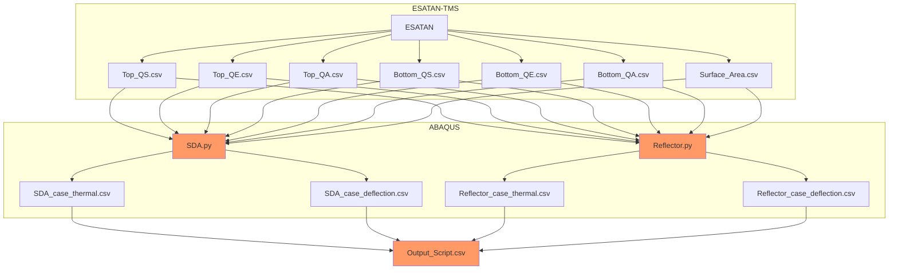

# SDA Thermo-Elastic Scripts
Author: Nathan van der Wielen

Contact Information: Nathan.jbm.vdw@gmail.com

NOTE: these scripts were made specifically for the thesis and were therefore not made with User friendliness in mind. Even with this README explaining the general aspect to keep in mind, to make the scripts properly work, it is important to study the scripts in detail.

## General Introduction
These scripts were created for Nathan van der Wielen's Thesis at the TU Delft: (Add doi-link)
These scripts are used in combination to study the thermo-elastic behavior of a novel kind of solid reflector being devolopped at the TU Delft. This reflector, that has the ability to deploy spiraly, could offer a new deployment mechanism for reflector is space. The thesis looks to study how the spiral dish antenna (SDA) deforms as it orbits in Low Earth Orbit (LEO) to see if it can properly perform.

## Scripts
* SDA.py - This script imports the ESATAN heat fluxes, builds an SDA model to which it applies the heat fluxes, performs a thermo-elastic analysis, and outputs the thermal and deflection results to csv files.
* Reflector.py - This script imports the ESATAN heat fluxes, builds an Base Model Reflector model to which it applies the heat fluxes, performs a thermo-elastic analysis, and outputs the thermal and deflection results to csv files.
* Output_Script.py - This script imports the thermal and deflection results from ESATAN and ABAQUS resulting csv files. It outputs different plot comparing the different "cases" that were studied durigng the thesis.

## Process
The process in which the previous scripts are used is as follows. After deciding what orbital case (Orbit, Inclination, Pointing, etc...) and geometry in which the SDA needs to be studied, 7 different csv files need to be output describing the heat fluxes and the surface areas of the different LPM nodes. All of this is done in ESATAN workbench. With the csv files describing the heat fluxes, surface areas, and times, the SDA.py and Reflector.py scripts can then be used. ABAQUS is needed to run the scripts. To use these scripts it is important to check and define the following parameters:

* Work Directory
* DirectoryName
* Case
* P_Height
* P_Diameter
* P_Spline_Division
* ESATAN_rad
* ESATAN-ang
* Section_thickness

These parameters make sure that the ESATAN and ABAQUS models match and that the heat fluxes are applied to the correct surfaces. The following aspects can be changed by commenting/uncommenting certain sections:

* Different meshing approaches
* Different material parameters
* Different load definitions
* Cavity radiation or not
* Different Field Output and History Output Requests

With these aspects considered, ABAQUS will perform a thermal and thermo-elastic analysis. If one is interested in only analyzing the SDA, only SDA.py needs to be run. The same is for the base reflector and Reflector.py. For optimal analysis, both SDA.py and Reflector.py are run as they allow for the comparison between an SDA reflector and a reflector that is similar in all shapes and form except that it does not have the spiral interface. Both SDA.py and Reflector.py output a _thermal.cvs and _deflection.csv files.

Output_Script.py reads the files output by ESATAN and ABAQUS and outputs at request a veriety of different plot to help compare the SDA and reflector. This script is run using a seperate python program and uses a "class" construction to allow for the analysis of different cases seprately.

